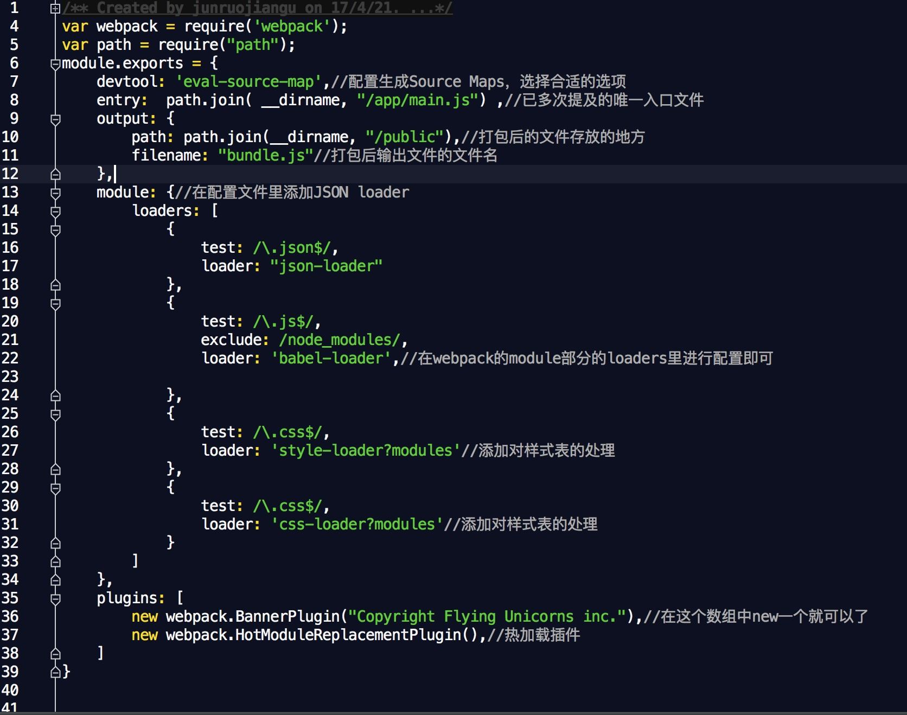
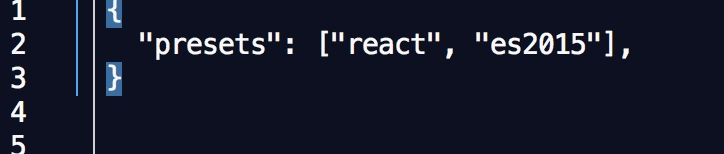
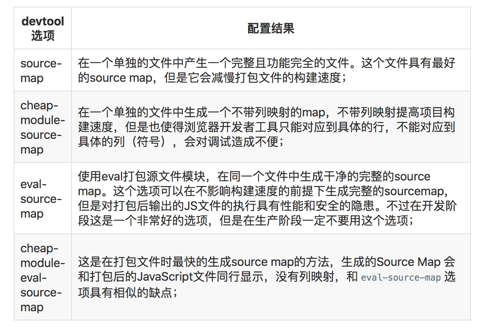
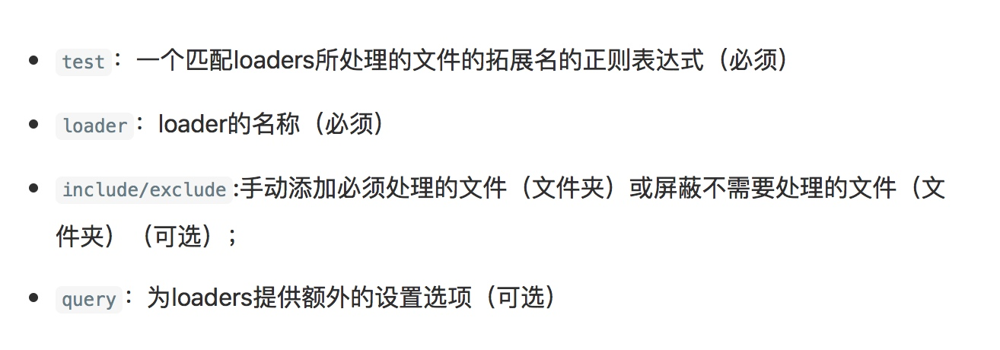

# 构建WebApp

1. 创建项目文件夹

2. 创建npm管理文件

```
npm init
//会在当前目录下生成package.json配置文件
```

* 安装依赖(在当前目录下)

```
    //安装发布依赖
    npm install --save name
    //安装开发依赖
    npm install --save-dev name
```

* 配置脚本

* 配置打包管理
    
    1. 安装webpack
    
    ```
        npm install --save-dev webpack
    ```
    2. 在当前目录下创建webpack.config.js
    
        * 配置输入输出（从一个文件入口，分析依赖并打包），大概长下边这样：
        
    ```
var path = require("path");
module.exports = {
    entry:  path.join( __dirname, "/app/main.js") ,//已多次提及的唯一入口文件
    output: {
        path: path.join(__dirname, "/public"),//打包后的文件存放的地方
        filename: "bundle.js"//打包后输出文件的文件名
    },
                
    ```
    * 配置映射文件 （打包编译后文件不容易定位，须有映射文件与编译后文件一一对应）
      添加到module.exports内
    
    ```
        devtool: 'eval-source-map',//配置生成Source Maps，选择合适的选项
    ```
    
    * 配置loader和plugins(最终它们大概长这个样子)
    

> babel 配置较多，可有单独配置文件.babelrc(babel:query)



###附录一： 打包映射选项


### 附录二： loader
选项


