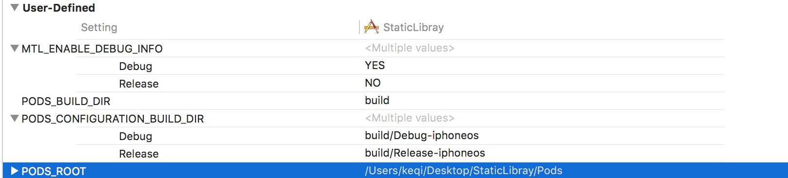

## 静态库打包
### 无cocoapods版

1. 创建cocoa Touch Framework
2. 更改版本
 

3. 变更为静态库
 
4. 添加public,向外公布的.h


5. 在Framework生成的.h内添加自己的.h
6. 设置CPU架构，No为全部通用的，Yes为当前的


7. 选择发布还是调试版本


8. 选择真机和模拟器分别Build一下，然后查看打包好的库


9. 检验架构

```
cd 进入framework目录下，
lipo –info <name>  # name 为framework名字
```


10. 配置 other link


11. 合并framework

```
lipo –create  <name1>.framework/<name1>  <name2>.framework/<name2> 
-output  <name1/name2>framework./<name3> 
```

### 有cocoapods版

1.	正常创建工程，导入cocopods，此以SDWebImage为例
2.	在工程内添加一个Target，类型选cocoa Touch Framework, 更改Deployment Target(如上第二步)
3.	将framework改为静态库（如上第三步）
4.	在framework引入自己的类文件
**注意配置时区分framework的target和项目本身的target！！！**

选取项目target,赋值header Search Paths至framework同位置，只需复制Public即可


赋值项目target的PODS_ROOT至framework的target同位置，需自己添加


5.	在header内添加向外公开的.h（如上第四步）
6.	在framework生成的.h内引用自己的.h(如上第五步)
7.	选择CPU架构（如上第六步）
8.	此处注意选择framework为目标编译（选择版本，如上第七步）
9．余下步骤和如上一样
………

注：Other linker Flags : -ObjC 没加也可以正常运行，此处加不加由具体情况决定，建议加上。

[TOC]


