# # # FFAir 从入门到放弃

> [TOC]

## cordova 环境配置

* npm 换源

```
npm install -g cnpm --registry=https://registry.npm.taobao.org
npm config set registry https://registry.npm.taobao.org
```
> 之后就可以以cnpm代替npm使用，除了不具备publich功能 

* 安装cordova

```
cnpm install -g cordova
```
## 创建iOS项目

> **[ ] 代表参数，自己起名字**

* 创建cordova项目

```
cordova create [FFAirDemo] [com.develop.all] [FFAirDemo]
```


1. [FFAirDemo]: 在当前文件夹下创建FFAirDemo文件夹
2. [com.develop.all]: ios工程的Bundle Identifier
3. [FFAirDemo]: 工程名字

* 利用cordova工程创建ios平台项目

进入工程目录下FFAirDemo，执行如下命令：

```
cordova platform add ios
```
项目结构如图所示：

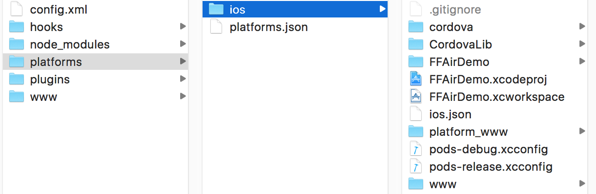

* 配置FFAir框架

1. 将ffair-plugins文件夹和reset-custom-plugins.sh 文件放入FFAirDemo目录下，然后执行.sh文件

```
注： 如果cordova是7.0，则ffair-plugins文件夹下的组件需要提供package.json配置文件
```

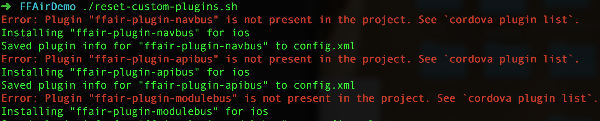
> 第一次执行如图所示为正常结果

2. 打开.xworkspace，在工程目录下新建文件夹FFAir,并将FFAir.framework导入
```
注： 稍后要配置路径，建议与作者保持一致
```

导入依赖的三方库:

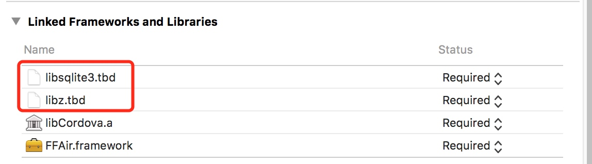

修改配置文件，否则控制台会打印关于iCloud存储数据警告，有可能被拒

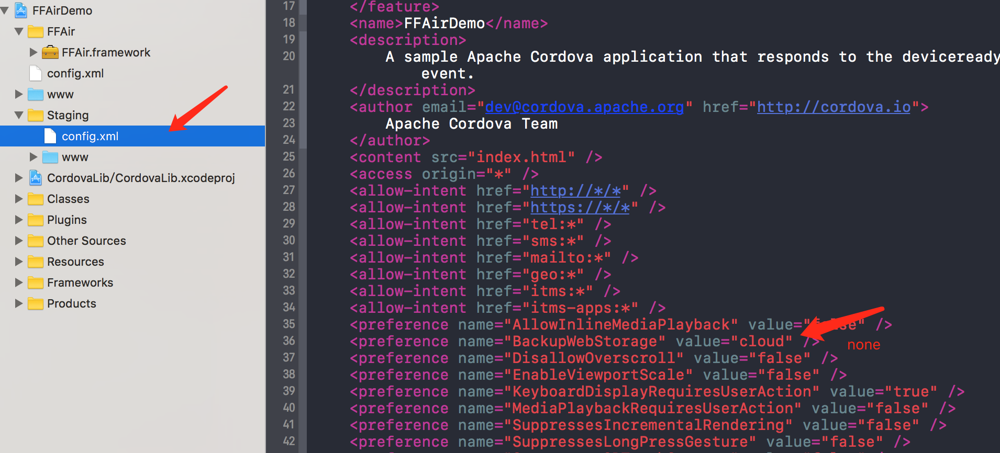

将BackupWebStorage的值从cloud改为none

* 添加资源文件

在项目FFAirDemo内新创建target,选择 macOS -> Bundle, 命名建议以"**_Resources"格式，然后选择该target,在其build setting内修改Base SDK为iOS，
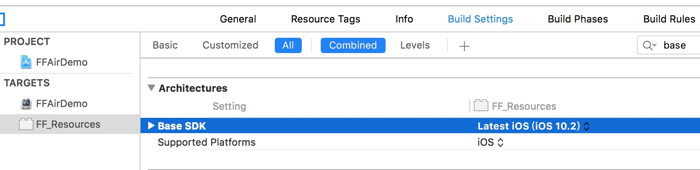
然后，设置该target的bitcode为No,
其次，选中项目target(FFAirDemo),在Build Phases中新建Copy Files，然后导入刚才创建的资源文件，如图所示：
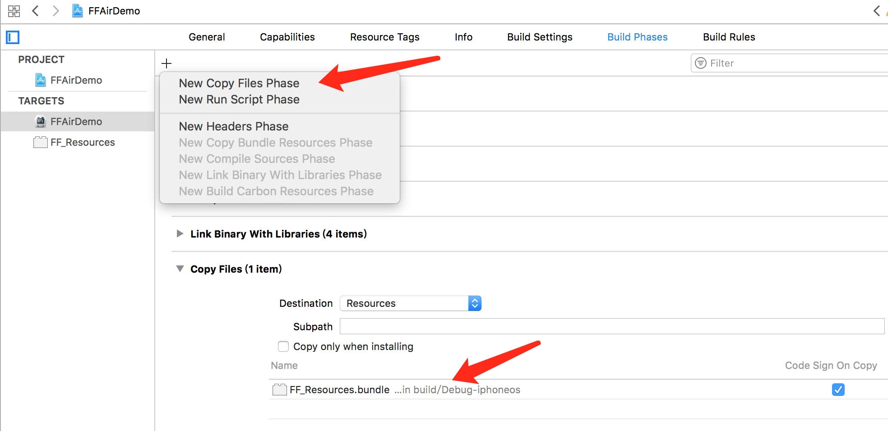

最后，在资源文件创建时自动新建的文件夹内建立配置文件，命名以"FFAir-**.xml"格式，如图：
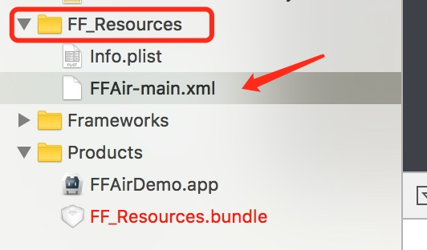

配置文件内容长这个样子：
(此处示例，默认以自带的MainViewController作为首页面，详细配置可参考官方介绍)

```
<?xml version="1.0" encoding="utf-8"?>

<FFAir remoteModule="false">
    <Modules>
        <Module name="m_home" icon="icon" isHome="true" label="首页">
            <Pages>
                <Page name="p_home" clazz="MainViewController" isModuleHome="true"/>
            </Pages>
        </Module>
        
    </Modules>
</FFAir>
```

好了，不要急，再愉快的撸几行代码就可以让项目跑起来了

在AppDelegate中，添加如下代码：
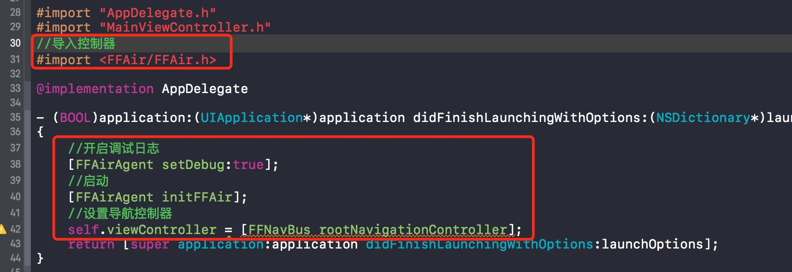
在MainViewController.h中，导入FFAir框架，修改其父类为FFNativeBaseViewController。

恭喜你，可以让项目愉快的跑起来了。（进入第二关）

## 添加子工程（子模块）

> 这个地方危机四伏，建议有条理的按照教程步骤一步步来，否则你懂得。。

1. 在项目新建project，选择framework
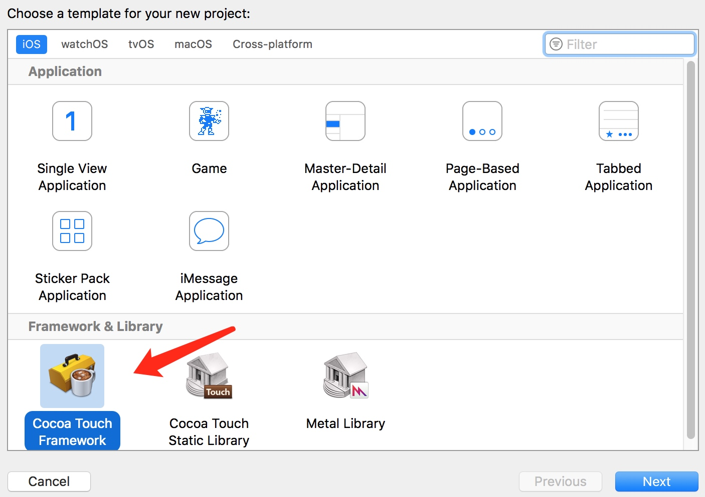
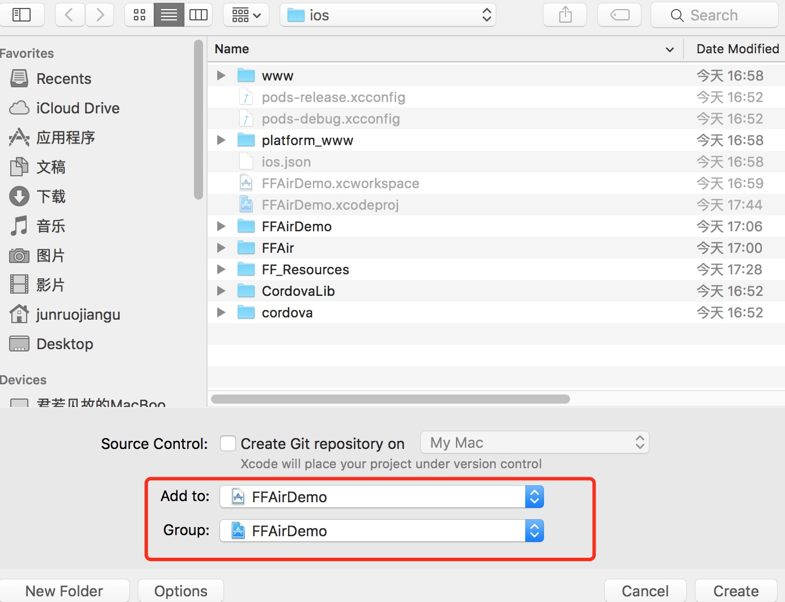

2. 修改一些配置

* 首先将该framework改为静态
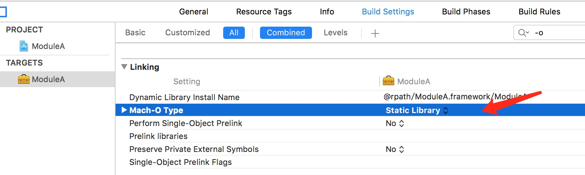

* 添加子工程对FFAirFramework的支持，在buildSetting -> Framework search Paths内添加FFAir路径，如图：（此处对应创建工程时FFAir放入时路径）

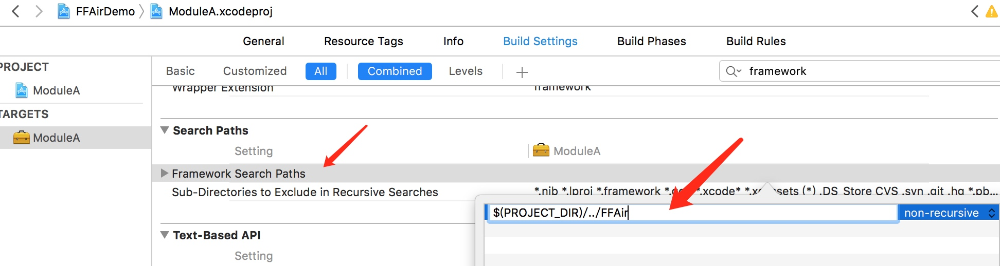

* 添加资源文件

> 因为外部工程方位子工程时，资源文件要放在bundle内才可被访问到
在子工程内新加target, 选择macOS -> bundle

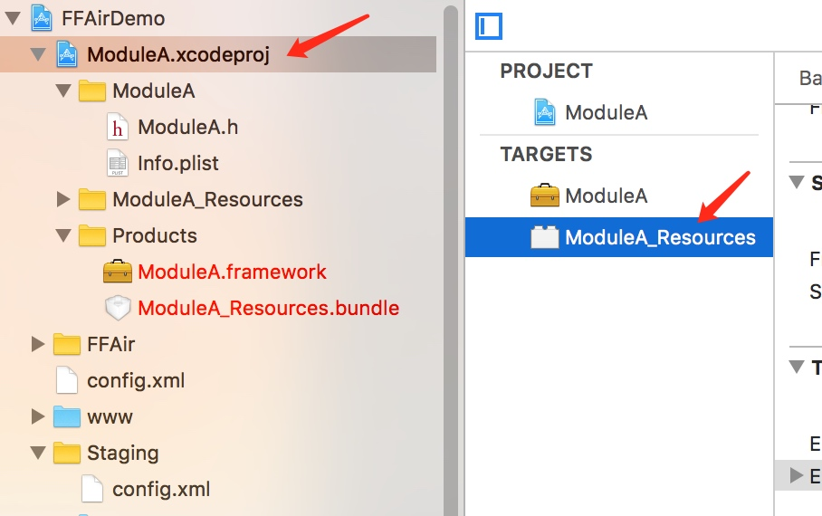

然后修改其Base SDK为ios, 关闭其bitcode。
然后你可在子工程内创建控制器及xib了，如图示例：
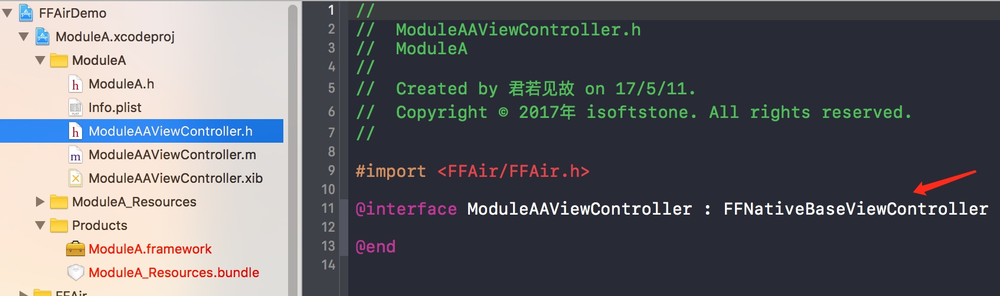
子类要继承FFNativeBaseViewController。

然后在子工程内选择资源文件target,在其Build Phases的 Copy Bundle Resources内添加xib，否则外部访问不到，如图：
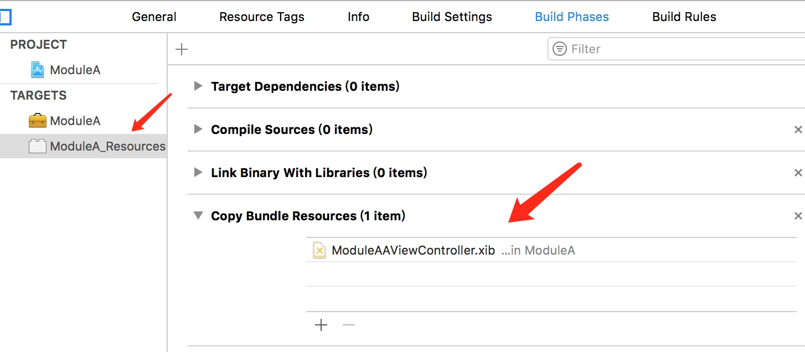

然后添加该模块的配置文件，在资源target的文件夹ModuleA_Resources内建立配置文件，命名依然以"FFAir-**.xml"格式，内容如图：（具体参考官方手册，此处示例）
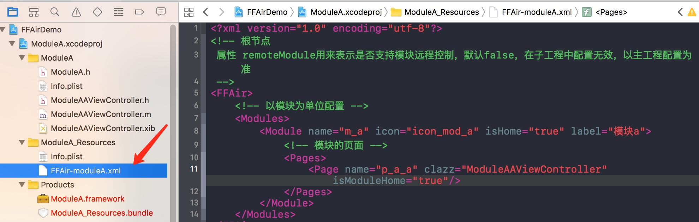

子模块配置完毕，但要和主项目工程管理起来，所以，回到我们的主项目工程FFAirDemo下，添加对子工程framework的引入
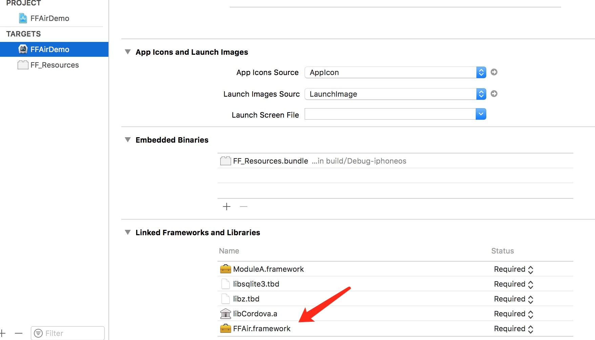
还要添加对子工程的资源文件的引用
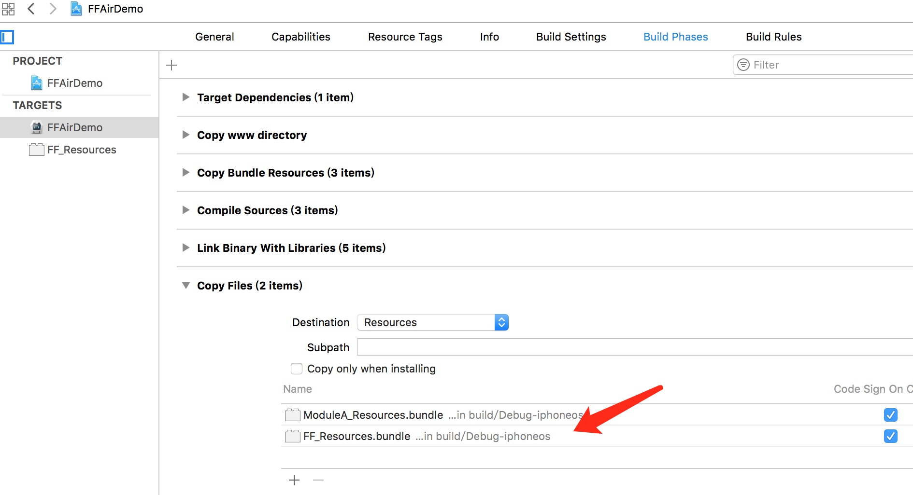

恭喜你，完成了复杂的模块的添加，其实本质是添加子工程和资源文件，并允许主工程的访问。但是，现在只能切换target并验证编译没有问题，并没有实际页面跳转访问子模块内容。（进入第三关）

## 页面跳转

基本跳转，验证流程及配置是否畅通。

在MainViewController视图加入按钮，点击事件如下：

```
- (IBAction)jumpToModuleA_a:(UIButton *)sender {
    
    [FFModuleHelper openModule:@"m_a"];
}
```

在ModuleAAViewController.m初始化方法中加入正确读取xib的方法,
因为子工程xib放入资源文件ModuleA_Resources.bundle中，所以主工程加载xib时需要重新设置路径

```
- (id)initWithNibName:(NSString *)nibNameOrNil bundle:(NSBundle *)nibBundleOrNil{
    if (nibBundleOrNil == nil) {
        NSString *path = [[NSBundle mainBundle] resourcePath];
        NSString *bundlePath = [NSBundle pathForResource:@"ModuleA_Resources" ofType:@"bundle" inDirectory:path];
        nibBundleOrNil = [NSBundle bundleWithPath:bundlePath];
    }
    self = [super initWithNibName:nibNameOrNil bundle:nibBundleOrNil];
    if (self) {
        
    }
    return self;
}
```


> "m_a"为子工程配置文件内所配置为该模块的唯一标示

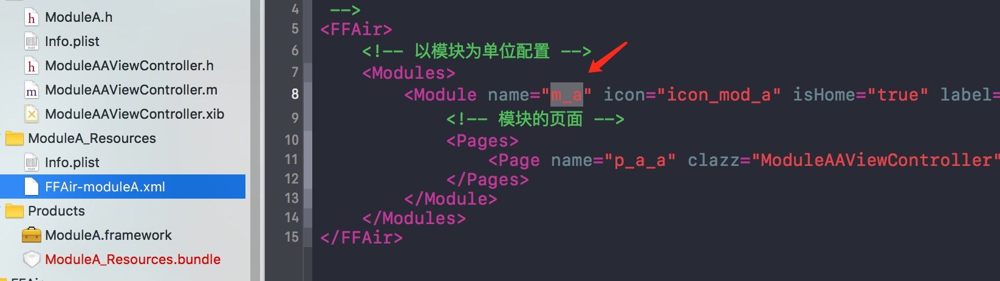


如果顺利跳转，恭喜你已经小学毕业了。若有问题，则自行检查上述步骤，接下来进入中高考折磨阶段。

# 实践

经过上一阶段，项目已经成功运转起来，但那只是把项目搭建起来，现在进入使用阶段。

## 本地模块

本地模块间跳转，包含：模块跳转，页面跳转及传值，H5页面跳转等。

### 模块间跳转

在项目搭建完成后，用来测试时，我们试了下跳转功能，用的是模块间跳转，从主模块p_home进入moduleA模块，默认加载模块首页p_a_a。

```
[FFModuleHelper openModule:ModuleName];
```

然后关于本地模块跳转H5模块，只需在www目录下创建对应的模块，然后在配置文件Neo如图配置，即可通过openModule方法跳转，如图：

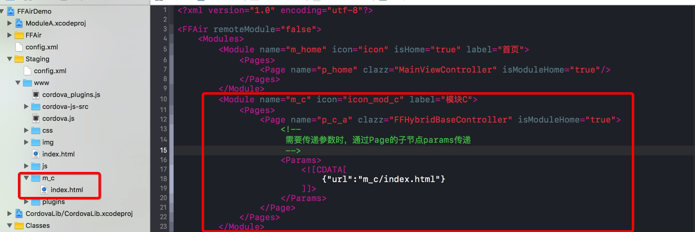


### 页面间跳转

新建控制器ModuleABViewController及其xib,然后将xib文件加入ModuleA_Resources -> Build Phases -> Copy Bundle Resources 内，如图：
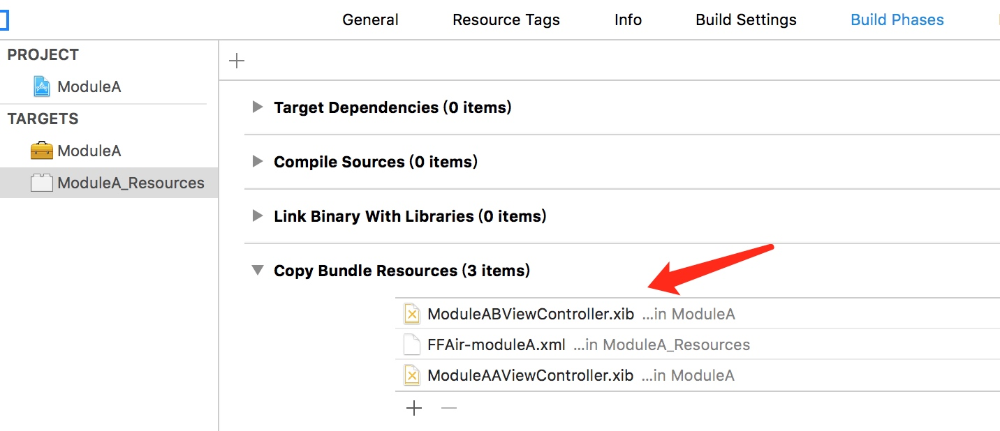

然后在该模块的配置文件中加入页面p_a_b的配置项，如图：
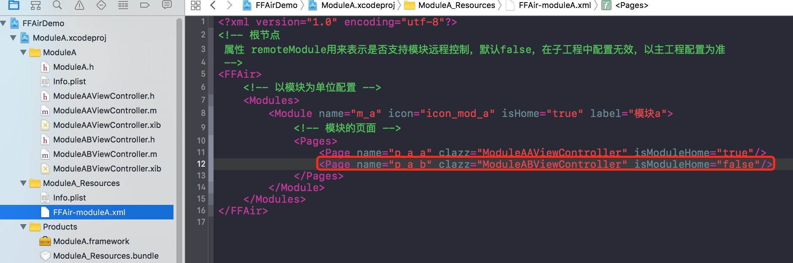

ok，现在可进行页面跳转
在ModuleAAViewController按钮点击事件中加入如下方法：

```
//返回上一层
- (IBAction)clickBack:(UIButton *)sender {
    
    [FFNavBus back];
}

//跳转至b页面，并附带参数
- (IBAction)JumpToA_b:(UIButton *)sender {
    
    [FFNavBus openPage:@"p_a_b" params:@"{\"key\": \"value\"}"];
}
```

在ModuleABViewController中,可获取参数及返回指定页面
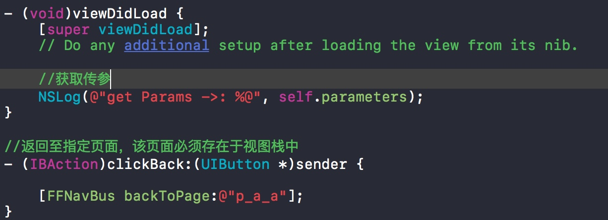


## 远程模块
- 修改`FFAir-main.xml`配置项
先新增图示内容：
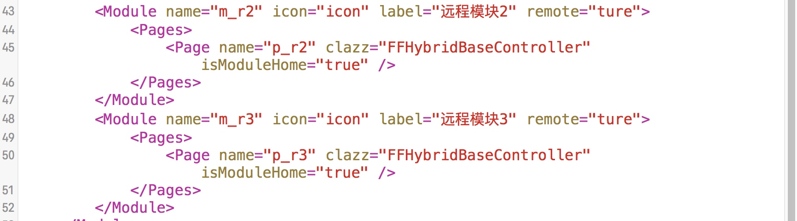
然后修改支持远程模块属性，如图所示：
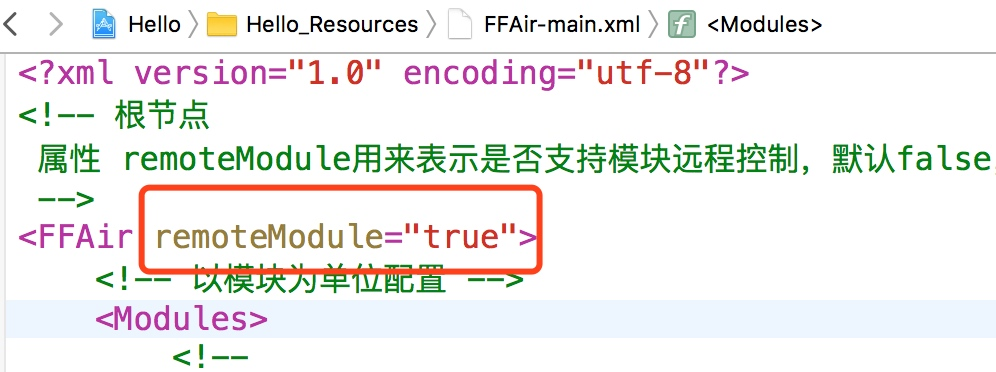

    **注：主工程的配置项名称必须为：`FFAir-main.xml`，不可更改**
- 修改APPDelegate.m文件
改用远程初始化方法，如图：
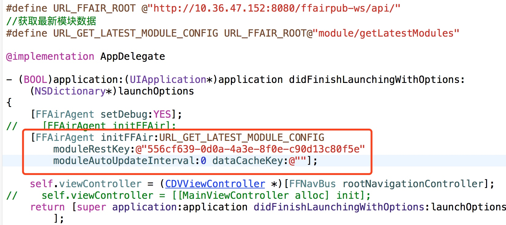

- 修改config.xml文件
注意目录结构，别选错文件了！！
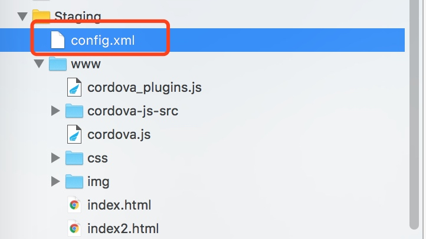
在文件里新增：`<allow-navigation href="*" />`，这样可以实现在应用内做网页跳转，而不新启应用打开链接。
- 进入[后台发布管理平台](http://10.36.47.152:3722/ffairpub/manager/biz/home/home.html)，账号密码：`admin/123456`
    - 新增应用：进入应用管理模块，点击新增，填写必填项，**注意包名必须与应用包名一致**，别忘了保存。
    - 新增应用版本管理：下载地址为应用新版本的下载地址，可先随便填，填完保存。
    - 新增模块：选取刚新增的应用，点击新增填写模块信息，**注意模块KEY不可修改，必须与上述`FFAir-main.xml`配置项里的远程模块Key一致**，示例为`m_r2`，
    - 新增模块版本：
    进入版本管理，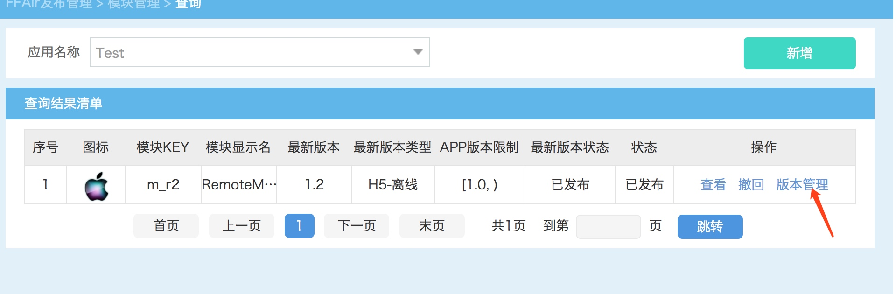然后点击发布新版本，填写完后保存，然后返回，点击修改进入修改界面，业务类型选H5，H5类型有离线和在线两种模式：
        - 在线：远程模块会跳转到对应的在线链接
        - 离线：远程模块会下载对应的离线包（需先上传本地离线包文件）
        
            注：打包必须在模块当前文件夹内打包，如图：
            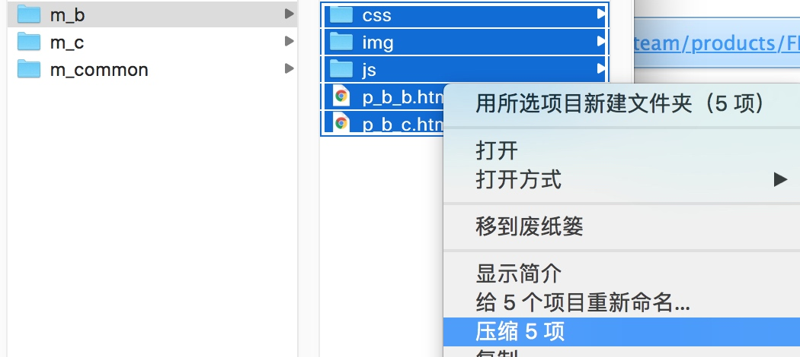


### 模块间跳转

跳转模块的事件里调用方法：
`[FFModuleHelper openModule:@"m_r2"]; （字符串为对应的模块名）`

在跳转事件的Controller里，需调用如下方法从服务器获取远程模块信息：
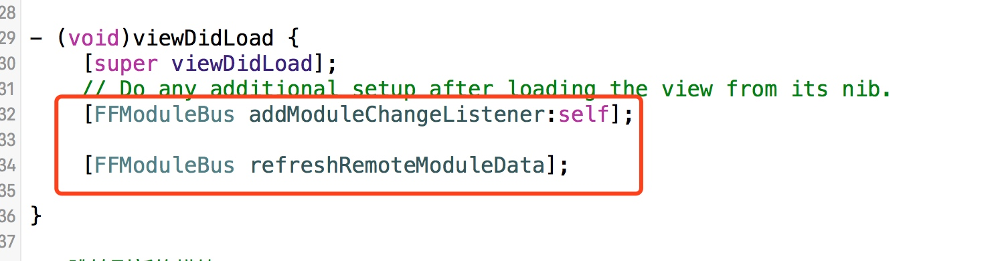


